# CognitiveSense Architecture Diagram

## 🏗️ System Architecture Overview

---

## Data Flow Diagram

---

## Agent Decision Tree

```mermaid
graph TD
    Start["Page Loads"]
    GetDomain["Get Domain<br/>from URL"]
    
    GetDomain -->|shopping site?| ShopCheck{Amazon<br/>Flipkart<br/>eBay?}
    GetDomain -->|social platform?| SocialCheck{Facebook<br/>Twitter<br/>Instagram?}
    
    ShopCheck -->|YES| ShoppingAgent["🛒 Shopping Agent<br/>6 Detectors"]
    ShoppingAgent -->|Analyze| ShopDetect["Urgency<br/>Anchoring<br/>Social Proof<br/>FOMO<br/>Bundling<br/>Dark Patterns"]
    
    SocialCheck -->|YES| SocialAgent["📱 Social Agent<br/>6 Detectors"]
    SocialAgent -->|Analyze| SocialDetect["Misinformation<br/>Emotional Manipulation<br/>Echo Chamber<br/>Fake Account<br/>Toxicity<br/>Political Manipulation"]
    
    ShopCheck -->|NO| NoAgent["No Agent<br/>Page Not Supported"]
    SocialCheck -->|NO| NoAgent
    
    ShopDetect -->|Results| Panel["Update Panel<br/>with Detections"]
    SocialDetect -->|Results| Panel
    NoAgent -->|Skip| Panel
    
    style ShoppingAgent fill:#e8f5e9
    style SocialAgent fill:#fce4ec
    style ShopDetect fill:#c8e6c9
    style SocialDetect fill:#f8bbd0
    style Panel fill:#e0f2f1
```

---

## Chrome AI APIs Integration

---

## Multi-Language Pipeline

---

## Scroll Detection Flow - Social Media

---

## Component Hierarchy

---

## Key Architecture Principles

### 1. **Agent-Based Design**
- Modular agents for different page types
- Easy to add new agents (News Bias, Social Pulse)
- Each agent manages its own detectors

### 2. **Separation of Concerns**
- Content Script: Page analysis
- Service Worker: Background tasks
- Panel: UI rendering
- Utilities: Shared functionality

### 3. **Chrome AI API Integration**
- Prompt API: Core detection logic
- Writer API: User-friendly content
- Translator API: Multi-language support
- Summarizer API: Future expansion

### 4. **Performance Optimization**
- Per-URL caching (each tab independent)
- Debounced scroll detection
- Parallel detector execution
- Lazy loading of detectors

### 5. **User Experience**
- Tab-aware panel (correct data per tab)
- Real-time language switching
- Clear visual indicators
- Actionable warnings and tips

---

## Scalability

---

## Deployment Architecture

---

**This architecture is designed for scalability, maintainability, and performance!** 🎉
